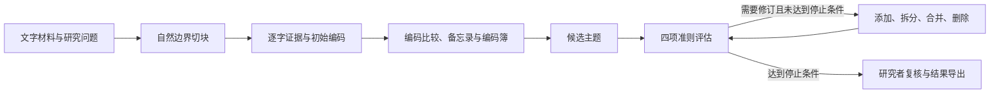

# TAMA · 人机协作的访谈质性分析

把访谈材料整理为可回溯的编码、候选主题和研究记录，让研究者能够检查每一步分析的依据。

TAMA 使用生成、评估与修订三个模型角色，完成从原文编码到主题迭代的工作。项目提供中文本地网页界面，也支持通过 Python 调用；适用于访谈、观察笔记和其他文字材料。研究问题、材料比较、分析决定与最终诠释由研究者掌握。

**Python 3.10+ · Streamlit 本地界面 · [MIT 许可证](LICENSE)**

[快速开始](#快速开始) · [使用流程](#使用流程) · [模型配置](#模型配置) · [结果与保存](#结果与保存) · [方法与边界](#方法与边界)

## 项目能做什么

| 能力 | 具体用途 |
| --- | --- |
| 原文与编码关联 | 编码保留逐字摘录、来源与原文位置；摘录无法匹配时标记为需要人工核对。 |
| 自然边界切块 | 按全文长度规划片段，优先保留完整问答、段落和说话人轮次。 |
| 编码比较与编码簿 | 比较原话和语境后提议归并，记录定义、包含与排除标准、定义演变及关联证据。 |
| 主题迭代 | 生成候选主题，按四项准则评估，再添加、拆分、合并或删除主题。 |
| 分析过程留痕 | 保留编码备忘录、主题备忘录、反例、证据缺口、评分历史与停止原因。 |
| 持续研究 | 接续前轮完整结果，加入新资料，记录比较与研究者确认的分析决定。 |
| 建构扎根理论支持 | 记录聚焦编码、类属属性与边界、理论抽样、关系与论证，支持研究者判断资料充分性。 |
| 报告与数据导出 | 下载 Word 报告与完整 JSON，或选择把研究记录保存到本地。 |

## 快速开始

准备 Python 3.10 或更高版本，以及 DeepSeek、MiMo 或 OpenAI 中任一服务的 API Key。

### 1. 获取项目并安装依赖

以下命令适用于 macOS / Linux：

```bash
git clone https://github.com/Chriss09-ui/TAMA.git
cd TAMA
python3 -m venv .venv
source .venv/bin/activate
python -m pip install -r requirements.txt
```

Windows 可使用 `python -m venv .venv` 创建环境，并在 PowerShell 中运行 `.\.venv\Scripts\Activate.ps1` 激活。

### 2. 启动网页界面

```bash
python -m streamlit run streamlit_app.py
```

在浏览器中打开终端显示的本地地址。项目默认监听 `127.0.0.1`。

### 3. 完成一次分析

1. 在侧栏选择服务商，输入 API Key；需要时使用“测试 API 连接”检查配置。
2. 粘贴材料，或上传 UTF-8 `.txt` / `.docx` 文件。
3. 按研究需要填写研究问题、关注点与来源信息，然后开始分析。
4. 检查编码证据、候选主题及“建议人工复核”的条目，下载 Word 报告或完整 JSON。

网页默认使用 DeepSeek，切块策略为“自动 · 均衡”，并发请求数为 4。模型调用和连接测试会产生真实 API 请求，费用按所选服务计收。

## 使用流程



### 研究设置

“通用主题分析”配置不预设研究领域，可自行填写研究问题和关注点。“企业能力与证据链”配置提供企业能力、内部证据、公开信息与信息断点的分析方向。关注点用于引导分析，不要求材料必须包含这些内容。

切块策略支持“自动 · 精细”“自动 · 均衡”“自动 · 少调用”和手动设置。界面会预览预计片段数；相互独立的片段编码和主题评估可并发执行，接口限流时可降低并发请求数。

分析过程中可以暂停、继续或取消。暂停与取消在请求边界生效，已经发出的请求可能仍会完成。刷新网页后可重新连接当前任务，需要保持本地服务运行。

### 接续前一轮研究

在“来源与持续研究”中接续当前结果，或载入之前下载的完整 JSON，再加入本轮新材料。每份新资料使用独立来源编号；新编码接续已有编号，相同标签不会自动覆盖不同来源的证据。

需要让已确认的分析决定指导下一轮时，选择要提交的决定并确认。前轮类属、比较与抽样记录也可选择纳入本轮分析；私人手记与自反记录保持独立。

### 建构扎根理论支持

在“来源与持续研究”的“分析方式”中选择“建构扎根理论支持”，可记录聚焦编码、类属发展、理论抽样任务、资料充分性判断、关系与论证，以及研究审查记录。编辑和保存这些记录本身不会调用模型。

这一模式提供研究过程的记录与分析支持；理论饱和、类属充分性和最终理论解释需要研究者结合资料判断。

## 模型配置

网页界面可直接输入 API Key，也可读取环境变量。点击“保存 API Key”会将密钥保存到本机系统凭据库（macOS 使用钥匙串）。密钥优先级为：本次输入 → 系统凭据库 → 环境变量。

| 服务商 | API Key 环境变量 | 示例脚本中的默认模型 | 示例脚本的可选配置 |
| --- | --- | --- | --- |
| DeepSeek | `DEEPSEEK_API_KEY` | `deepseek-flash` | `DEEPSEEK_MODEL`、`DEEPSEEK_BASE_URL` |
| MiMo | `MIMO_API_KEY` | `mimo-v2.5-pro` | `MIMO_MODEL`、`MIMO_BASE_URL` |
| OpenAI | `OPENAI_API_KEY` | `gpt-4o` | `OPENAI_MODEL` |

上表描述本仓库的默认配置。具体可用模型与接口地址以服务商及你的账号配置为准；网页界面的模型名称，以及 DeepSeek / MiMo 的接口地址，可在侧栏调整。DeepSeek 在界面中显示为 `DeepSeek-V4.1-Flash`，请求时映射为 `deepseek-flash`。

### 运行示例脚本

在已激活的虚拟环境中，设置任一服务的密钥。例如：

```bash
export DEEPSEEK_API_KEY='替换为你的密钥'
python example_usage.py
```

脚本在缺少 `data/sample_transcript.txt` 时创建示例材料，运行分析并保存结果。多个密钥同时存在时，脚本按 **MiMo → DeepSeek → OpenAI** 的顺序选择服务；网页界面按侧栏选择使用服务。

### Jev 决策模式（实验性）

默认“跟随主模型”使用主模型完成结构化评分。选择“Jev（实验性）”后，Jev 负责主题评分与修订判断，编码、主题生成和文字反馈仍由主模型完成。网页中需单独配置 Jev Key；示例脚本通过 `JEV_API_KEY` 启用，也支持 `JEV_BASE_URL` 与 `JEV_MODEL`。

评估会记录各准则的置信度，低于阈值的条目标记为“建议人工复核”。主模型自报的置信度不能视为经过校准的概率，Jev 在具体研究材料上的表现也需要实际验证。

## 结果与保存

网页默认关闭“保存本地结果”和“保存阶段文件”，结果保留在本地服务进程中，可手动下载：

- **Word 报告（DOCX）**：主题、支持证据、研究记录与供研究者补充的诠释部分。
- **完整数据（JSON）**：编码、主题、评估、修订历史、研究记录与运行配置，可用于后续研究。

开启本地保存后，文件写入 `outputs/<session_name>/`。同名会话会追加后缀，避免覆盖已有结果。

| 文件 | 内容 |
| --- | --- |
| `00_final_results.json`、`00_summary.txt` | 完整结果与可读摘要，开启“保存本地结果”时生成。 |
| `04_code_memos.md`、`04_memos.md`、`04_memos.json` | 编码与主题备忘录、支持理由、反例和不确定性。 |
| `04_memos_iter*.json` | 各轮主题备忘录，供回看分析过程。 |
| `05_codebook.md` | 编码定义、包含与排除标准、证据与定义演变。 |
| `06_code_map.md`、`07_code_landscape.md` | 从编码到类别与概念的映射，以及编码证据数量概览。 |
| `08_research_records.md` | 来源、比较、分析决定、类属、抽样、关系与研究审查记录。 |
| `next_data_plan.md` | 下一轮需补访、查阅或核对的问题。 |
| `01_generation.json` | 原始片段与编码，仅在开启“保存阶段文件”时生成。 |
| `02_evaluation_iter*.json`、`03_refinement_iter*.json` | 逐轮评估与修订，仅在开启“保存阶段文件”时生成。 |

只要开启任一本地保存选项，就会生成相应的研究记录文件。通过 Python 调用时，`run_analysis()` 默认保存最终结果、关闭阶段文件；同时传入 `save_final=False` 和 `save_intermediate=False` 可仅在内存中运行。

### 数据与隐私

界面在本机运行，模型分析会将相关材料、编码和主题发送给所选服务；启用 Jev 时，主题评估内容也会发送给 Jev。保存和下载的结果包含逐字证据，应按研究资料管理。

私人备忘录中 `**[human]**` 与 `**[/human]**` 之间的手记、自反记录不会作为模型输入。结果可通过“清除服务内结果”从当前服务的结果缓存中清除，已下载或已保存的文件仍保留。

`outputs/`、`reflexivity.md`、环境文件和两份本地项目讲解文件已加入 `.gitignore`。

## Python 调用

在项目根目录中运行，先配置 `DEEPSEEK_API_KEY`：

```python
import os
import sys
from pathlib import Path

sys.path.insert(0, str(Path("src").resolve()))
from tama import TAMAFramework, load_transcript

framework = TAMAFramework(
    api_key=os.environ["DEEPSEEK_API_KEY"],
    model="deepseek-flash",
    base_url="https://api.deepseek.com",
    research_question="受访者如何在不确定性中作出决定？",
    focus_areas=["决策过程", "信息来源", "不确定性"],
    max_iterations=5,
    acceptance_threshold=4.0,
)

result = framework.run_analysis(
    transcript=load_transcript("你的访谈.txt"),
    session_name="my_study",
    save_final=True,
    save_intermediate=False,
)

print("候选主题数：", len(result["final_themes"]))
print("停止原因：", result["stop_reason"])
print("结果目录：", result["output_dir"])
```

`load_transcript()` 读取文本文件。DOCX 的正文段落与表格按文档顺序提取，可通过网页上传；扫描件和图片需先转换为文字。

## 方法与边界

主题评估使用四项准则：**覆盖度、模式性、区分度、相关性**。默认验收要求平均分及每个主题的每项准则都达到 4 分（满分 5 分），并且没有主题需要修订；平均分达标本身不够。

结果记录 `score_history` 与 `stop_reason`：

| 停止原因 | 含义 |
| --- | --- |
| `accepted` | 达到配置的评分与修订要求。 |
| `no_improvement` | 连续评估缺少足够提升，触发早停。 |
| `max_iterations` | 已达到设置的最多评估轮次。 |

这些状态表示本轮程序为何停止。模型分数用于辅助检查，不能证明研究结论有效，也不能判定理论饱和。编码出现次数同样不能直接代表其研究意义；候选解释、反例与证据缺口需要回到原材料核对。

本仓库实现了 TAMA 风格的多角色分析流程，未实现 TAMA 论文中的全部定量验证指标。当前方法设计及软件支持分别记录在：

- [《质性研究入门指南》对照说明](METHODOLOGY.md)：总体研究立场、证据、备忘录与报告设计。
- [《质性研究编码手册》对照说明](编码手册对照/项目如何符合编码手册.md)：编码周期与编码操作。
- [建构扎根理论对照](建构扎根理论对照/README.md)：持续比较、类属发展、理论抽样与当前实现。

## 项目结构与开发

```text
streamlit_app.py       本地网页入口
example_usage.py       命令行示例
src/tama.py           分析流程编排
src/agents/           生成、评估与修订角色
src/decisions/        主模型与 Jev 决策接口
src/prompts.py        模型指令与评估准则
src/research_records.py  研究记录与持续研究的数据结构
src/research_ui.py    研究记录编辑界面
src/reporting.py      摘要与 Word 报告
tests/                自动化测试
```

在安装依赖后，从项目根目录运行测试：

```bash
python -m unittest discover -s tests
```

更多说明见 [安装指南](INSTALLATION.md)、[使用指南](USAGE_GUIDE.md) 和 [项目结构](PROJECT_STRUCTURE.md)。部分扩展文档保留早期示例，当前界面与保存行为以本 README 和代码为准。

## 许可证

本项目使用 [MIT 许可证](LICENSE)，保留原有作者的版权声明。
