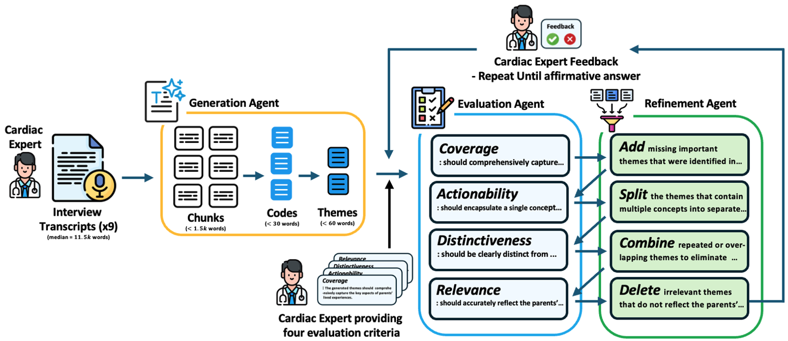

# TAMA: Human–AI Collaborative Thematic Analysis using Multi-Agent LLMs


## Overview

TAMA is a human–AI collaborative framework for inductive thematic analysis of long, qualitative clinical interview transcripts. It uses a structured multi-agent workflow—Generation, Evaluation, and Refinement agents—combined with clinician-defined criteria to produce accurate, distinct, and clinically relevant themes. The framework reduces manual coding times by more than 99% while improving thematic coverage, distinctiveness, and alignment with expert-generated themes. TAMA was evaluated on de-identified interviews from parents of children with congenital heart disease and outperformed single-agent LLM baselines across multiple quantitative metrics.

## Quick Start

**Get started in 5 minutes!** See [QUICKSTART.md](QUICKSTART.md) for detailed instructions.

```bash
pip install -r requirements.txt
export OPENAI_API_KEY='your-api-key'
python example_usage.py
```

### Xiaomi MiMo API

The example also supports Xiaomi MiMo through its OpenAI-compatible API. Set
`MIMO_API_KEY` to use MiMo instead of OpenAI. The default MiMo model is
`mimo-v2.5-pro`, which supports the JSON output used by all three agents.

```bash
export MIMO_API_KEY='your-mimo-api-key'
python example_usage.py
```

For a MiMo Token Plan, set `MIMO_BASE_URL` to the OpenAI-compatible Base URL
provided for your plan. You can also set `MIMO_MODEL` to another model that
supports JSON output, such as `mimo-v2.5`. When multiple provider keys are set,
the example uses MiMo first. For direct `TAMAFramework` use, pass the MiMo API key,
`model="mimo-v2.5-pro"`, and
`base_url="https://api.xiaomimimo.com/v1"` (or your Token Plan Base URL).

See the [MiMo first API call](https://mimo.mi.com/docs/zh-CN/quick-start/summary/first-api-call)
and [structured output](https://mimo.mi.com/docs/zh-CN/quick-start/usage-guide/text-generation/structured-output)
documentation for current endpoints and supported models.

### DeepSeek API

DeepSeek offers an OpenAI-compatible API and JSON output for the analysis
agents. Set `DEEPSEEK_API_KEY` to use the DeepSeek-V4.1-Flash model through
its API model ID `deepseek-flash` and official OpenAI-compatible endpoint
`https://api.deepseek.com`:

```bash
export DEEPSEEK_API_KEY='your-deepseek-api-key'
python example_usage.py
```

You can override the defaults with `DEEPSEEK_MODEL` or `DEEPSEEK_BASE_URL`.
When multiple provider keys are set, `example_usage.py` selects MiMo, then
DeepSeek, then OpenAI. The web interface starts with DeepSeek selected and
shows `DeepSeek-V4.1-Flash` as its model name; requests use `deepseek-flash`.
Enter the API key in the sidebar or set `DEEPSEEK_API_KEY`. See the [DeepSeek first API call](https://api-docs.deepseek.com/zh-cn/)
and [JSON output](https://api-docs.deepseek.com/zh-cn/guides/json_mode/)
documentation for the current model names and endpoint.

### Local web interface

Install the dependencies and launch the local interface:

```bash
pip install -r requirements.txt
streamlit run streamlit_app.py
```

The interface accepts pasted text, a UTF-8 `.txt` file, or a `.docx` file.
DOCX body paragraphs and table rows are read in document order; scanned pages
or images need OCR before analysis. Select MiMo,
DeepSeek, or OpenAI in the sidebar, then enter the API key or set the selected
provider's `MIMO_API_KEY`, `DEEPSEEK_API_KEY`, or `OPENAI_API_KEY` environment
variable. Results appear on the page and are saved
under `outputs/`. The app listens on `127.0.0.1` for local use.

After analysis, use **保存 Word 报告（DOCX）** to download a readable report with
the final themes, descriptions, and associated codes. Use **保存完整数据（JSON）**
to download the complete result for later processing. The framework also
automatically writes `00_final_results.json` and `00_summary.txt` in the
session's `outputs/` directory.

To keep an API key across browser and app restarts, enter it in the sidebar and
click **保存 API Key**. The key is stored in the operating system credential store
(macOS Keychain on macOS), separately for each provider, rather than in the
repository or `outputs/`. Leave the field empty to use the saved key; click
**删除已保存 Key** to remove it. A newly typed key takes precedence over a saved
key, and a saved key takes precedence over the provider's environment variable.

Use **测试 API 连接** in the sidebar to send one short request with the current
key, model, and endpoint; the provider may charge for it. During analysis,
**暂停分析** waits for any request already in progress to finish, then stops
before the next model request. **继续分析** resumes the same run. Keep the
browser page and local Streamlit service open while the analysis runs.

Set **初始切块大小（字词/块）** in the sidebar before starting analysis. The
Generation Agent uses it for the first transcript split (default: 4000 units):
Chinese characters count individually, while other text is counted by
whitespace-separated words. Punctuation and original spacing remain in each
chunk. Smaller chunks generally mean more model requests. The selected value
is recorded as `configuration.chunk_size` in the final JSON result.

Independent code extraction requests and theme evaluations run concurrently.
The sidebar's **并发请求数** defaults to 4 and can be set from 1 to 8; lower it
if the model provider rate-limits requests. Results keep the original chunk
and theme order. Theme generation still waits for all codes, and refinement
waits for all evaluations. Pausing blocks requests that have not started yet;
requests already sent to the provider may finish first. The selected limit is
recorded as `configuration.max_workers` in the final JSON result.

### Decision model integration (System One / Jev)

Theme evaluation uses a hybrid two-stage flow. A decision provider first
answers typed questions for each theme (four 1–5 criterion scores plus a
yes/no refinement decision), each with a confidence value. Themes that pass
every criterion with confident decisions skip the expensive feedback call;
themes with any score below 4, a refinement decision, or a confidence below
the threshold get a second call that writes feedback text and refinement
suggestions. Decisions with low confidence are marked `建议人工复核` in the
results.

Two decision providers are available:

- **跟随主模型 (default)**: the selected analysis model answers the typed
  questions in JSON mode. Confidence values are self-reported by the model —
  a weak signal kept for the audit trail, not a calibrated probability.
- **Jev（实验性）**: the TypeSafe Jev System One decision API
  ([docs](https://docs.typesafe.ai/api)) returns probability-based scores and
  confidence in a single request per theme. Select this mode and enter the
  Jev API key in the sidebar; it can be stored in the system credential vault.
  `JEV_API_KEY` remains available as a fallback, with optional `JEV_BASE_URL`
  and `JEV_MODEL`. The sidebar's **测试 API 连接** verifies the decision
  endpoint separately.

The sidebar's **决策模式** selects the provider. The confidence threshold
lives under **高级设置** (default 0.7). Saved results record the provider and
threshold under `configuration.decision_provider` /
`configuration.confidence_threshold`, and each theme evaluation carries
`score_confidences`, `raw_scores`, `flagged_for_review`, and
`feedback_source` (`llm`, `placeholder`, or `fallback`) under
`final_evaluation.theme_evaluations` and, when stage files are enabled, in
`02_evaluation_iter*.json`. If a decision request fails with a recoverable
error, the theme falls back to the legacy single-call evaluation and the
result is marked `fallback`. Jev configuration errors (for example an
invalid key) stop the run instead of being silently ignored.

## Key Features

- Multi-agent LLM architecture with coordinated Generation, Evaluation, and Refinement agents.
- Human-in-the-loop design with clinician-defined goals, evaluation criteria, and final approval.
- Decision-model integration: theme scores carry per-criterion confidence; low-confidence themes are flagged for human review.
- Quantitative evaluation using Jaccard similarity, hit rate, and embedding-based cosine similarity.
- End-to-end thematic analysis completed in under ten minutes, reducing manual workload by more than 99%.

## Architecture

The TAMA framework uses a multi-agent workflow consisting of Generation, Evaluation, and Refinement agents, with iterative oversight from a clinical expert. The expert provides initial goals and evaluation criteria and makes the final decision to accept or revise the generated themes.

### Workflow Diagram


## Installation

### Prerequisites
- Python 3.10 or higher
- An API key for MiMo, DeepSeek, or OpenAI

### Quick Setup

```bash
# Run from the project directory
pip install -r requirements.txt

# Set API key
export OPENAI_API_KEY='your-api-key-here'

# Run example
python example_usage.py
```

For detailed installation instructions, see [INSTALLATION.md](INSTALLATION.md).

## Usage

### Basic Example

```python
import os
from src.tama import TAMAFramework, load_transcript

# Initialize framework
tama = TAMAFramework(
    api_key=os.getenv("OPENAI_API_KEY"),
    model="gpt-4o",
    max_iterations=5,
    acceptance_threshold=4.0
)

# Load transcript and run analysis
transcript = load_transcript("data/your_transcript.txt")
result = tama.run_analysis(
    transcript=transcript,
    session_name="my_analysis",
    save_intermediate=True
)

# Access results
print(f"Generated {len(result['final_themes'])} themes")
print(f"Final score: {result['metadata']['final_average_score']:.2f}/5.0")
```

### Custom Evaluation Criteria

The runtime instructions are written in Chinese. Generated codes, themes, and
feedback follow the language of the supplied interview text. The prompts make no
assumptions about the topic. Set `expert_criteria` to reflect a particular study's
research questions when needed. The bundled sample transcript is a clinical example.

```python
# Define study-specific criteria from researchers
expert_criteria = {
    "coverage": "应覆盖材料中的重要规律",
    "actionability": "应表达一个清楚、便于理解的概念",
    "distinctiveness": "应与其他主题明确区分",
    "relevance": "应准确反映受访者的表达，并有材料支持"
}

tama = TAMAFramework(
    api_key=api_key,
    expert_criteria=expert_criteria
)
```

### Output Structure

Results are saved to `outputs/[session_name]/`:
- `00_final_results.json` - Complete analysis results
- `00_summary.txt` - Human-readable summary
- `01_generation.json` - Initial generation output
- `02_evaluation_iter*.json` - Evaluation results per iteration
- `03_refinement_iter*.json` - Refinement operations per iteration

## Framework Components

### 1. Generation Agent
- **Chunking**: Splits transcripts into 3-5k word segments
- **Coding**: Extracts codes (<25 words) from each chunk
- **Theme Generation**: Synthesizes codes into themes (~25 words)

### 2. Evaluation Agent
Evaluates themes using four criteria:
- **Coverage**: Comprehensively captures important patterns
- **Actionability**: Encapsulates single, clear concept
- **Distinctiveness**: Clearly distinct from other themes
- **Relevance**: Accurately reflects the data

### 3. Refinement Agent
Refines themes using four operations:
- **Add**: Add missing important themes
- **Split**: Split themes containing multiple concepts
- **Combine**: Combine overlapping themes
- **Delete**: Delete irrelevant themes

### Iterative Process
The framework iterates through evaluation and refinement until:
- Themes achieve acceptance threshold (default: 4.0/5.0), OR
- Maximum iterations reached (default: 5)
